## 功能介绍 

中小学微官网小程序：面向中小学的轻量化校园门户，集校园资讯展示、访客与活动预约、个人中心管理于一体，为师生、家长及访客提供便捷的校园信息获取与服务入口，同时为学校提供高效的后台管理能力。

##### 用户端核心功能：
- 1. 校园资讯栏目
栏目分类：提供学校概况、校园资讯、校园风光、德育工作、教师园地、学生天地、校友情深等多个栏目，全面展示校园风貌与动态。
内容交互：支持查看详情、分享内容、检索关键词，方便用户快速获取所需信息。
- 2. 服务预约
预约类型：分为来访预约和校园活动预约，满足不同场景需求。
预约展示：可查看可约时段、已约人数等信息，清晰了解预约状态。
信息登记：预约时需填写姓名、电话等资料，确保信息准确。
核销管理：管理员可扫码核销，用户也可在个人中心查看核销码，出示给工作人员完成核验。
- 3. 个人中心
我的预约：可查看预约详情、核销二维码，支持取消预约操作。
资料管理：支持个人资料修改，方便更新信息。
浏览与收藏：记录浏览历史，支持收藏感兴趣的内容，便于后续查看。

##### 后台管理端核心功能
- 1. 栏目管理
支持对资讯栏目进行添加、修改、删除操作，灵活维护校园资讯内容。
- 2. 预约服务管理
规则配置：可设置预约日期、时段、排序规则及规则介绍，自定义预约流程。
状态控制：支持关闭或删除预约项目，灵活调整服务安排。
- 3. 预约名单管理
可查看用户预约详情、预约记录，支持取消预约和操作核销，高效管理预约流程。
- 4. 扫码核销
管理员通过扫描用户提供的核销码，快速完成预约核验，提升管理效率。
- 5. 预约名单导出
支持按开始 / 结束日期筛选，可在线浏览或导出 Excel 文件到本地，方便数据统计与存档。
- 6. 用户管理
可搜索、查看、删除用户信息，支持按注册排序，也可导出用户数据，便于用户管理。
- 7. 管理员操作
权限管理：可增删改查管理员，区分普通管理员与核销员角色。
账号安全：支持修改密码、调整账号状态，保障后台安全。

 

## 技术运用
- 前端基于微信小程序平台进行开发
- 后端基于Java Springboot架构开发
- 数据库： MySQL (8.0+) 

## 演示 
 

## 安装

- 安装手册见源码包里的word文档 

## 截图

 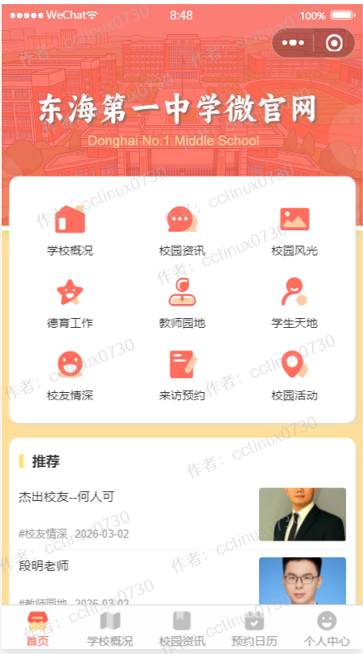
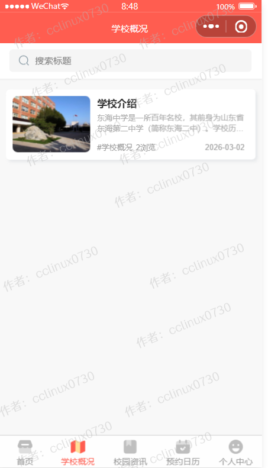 
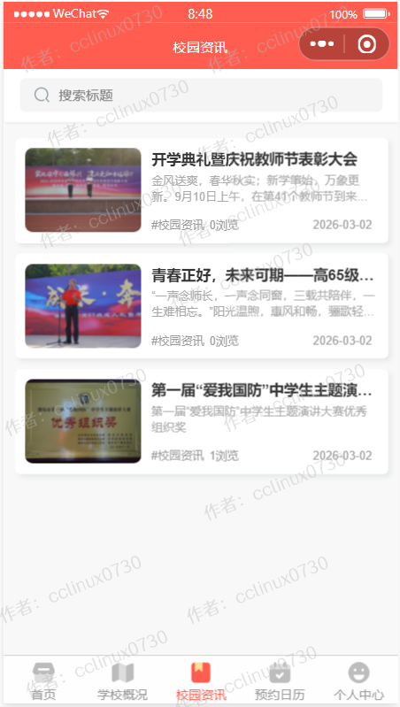
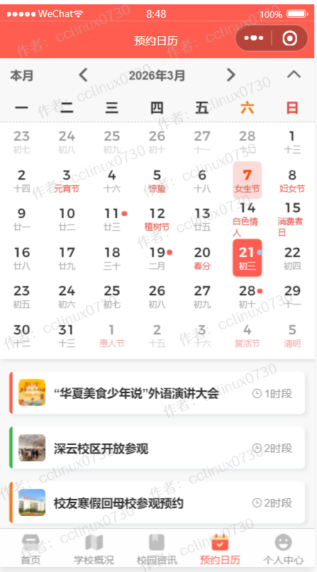
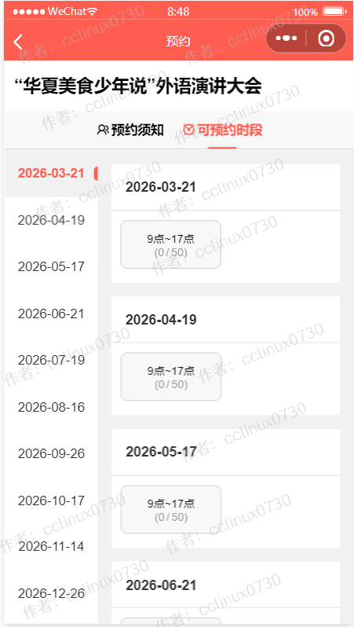
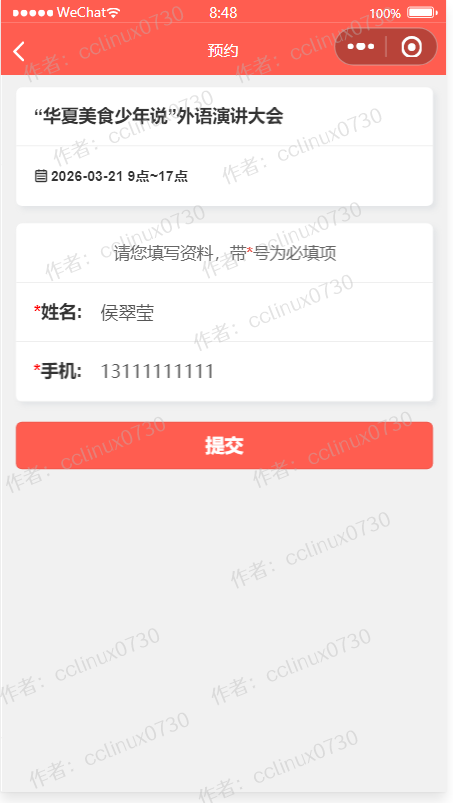 
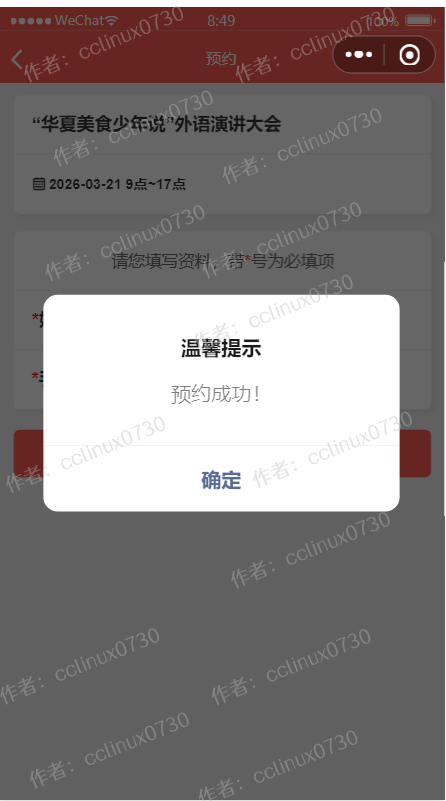
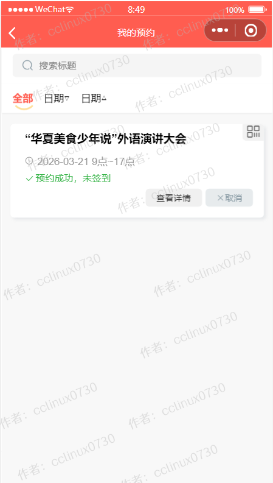
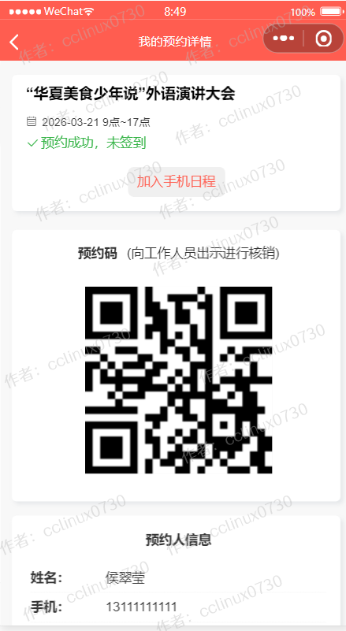 
## 后台管理系统截图 
- 后台超级管理员默认账号:admin，密码123456，请登录后台后及时修改密码和创建普通管理员。
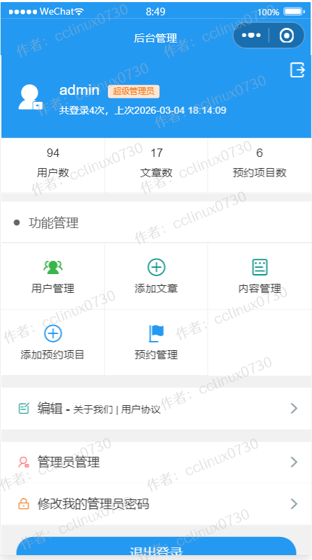 
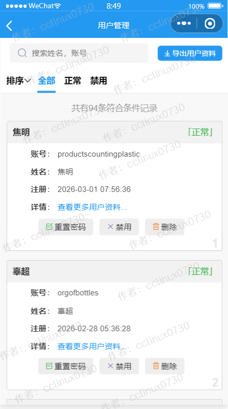 
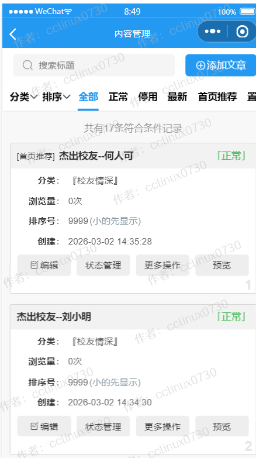
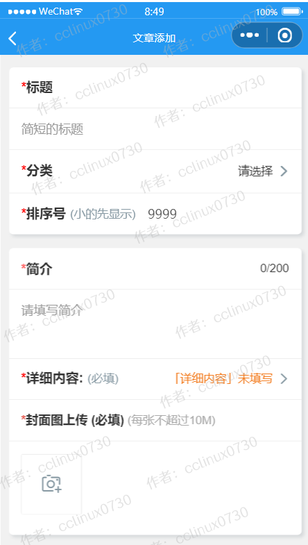 
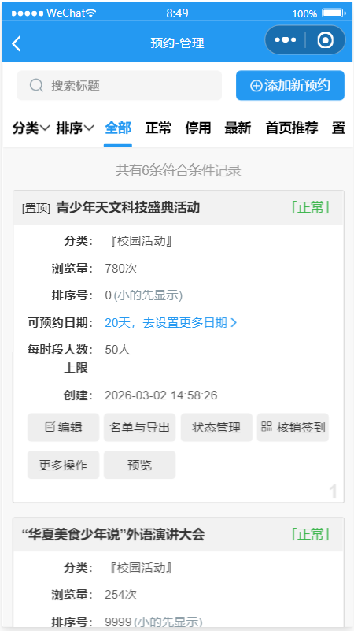 
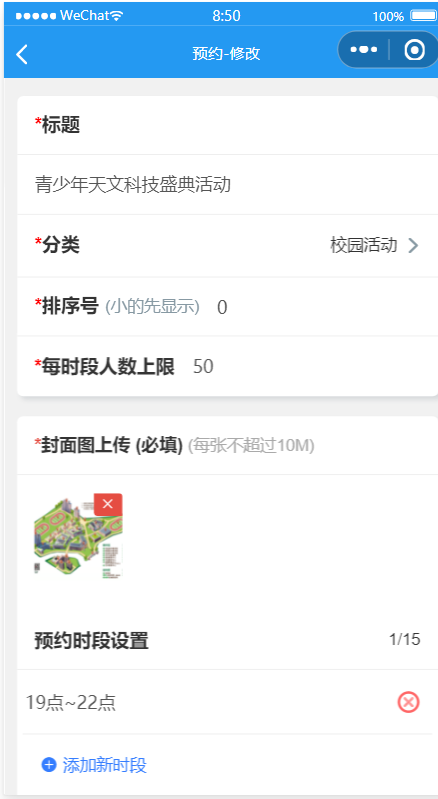 
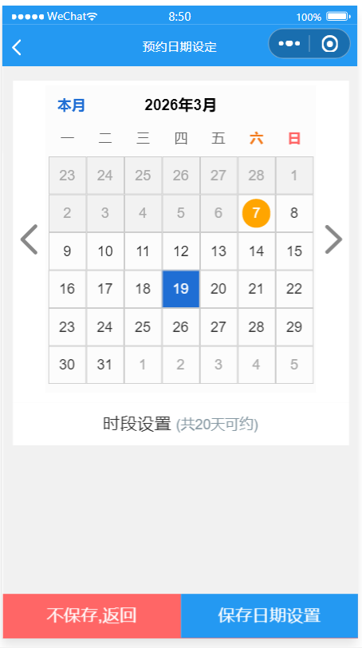 
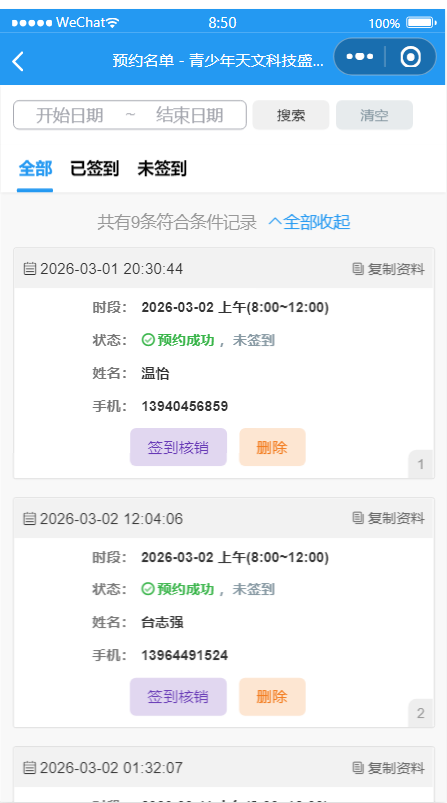
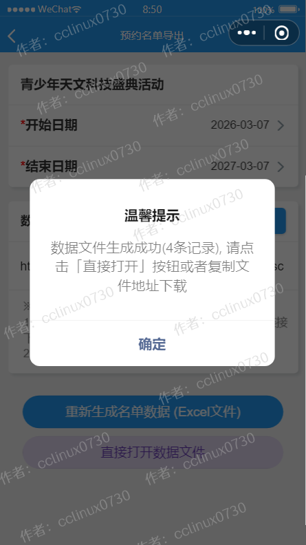 
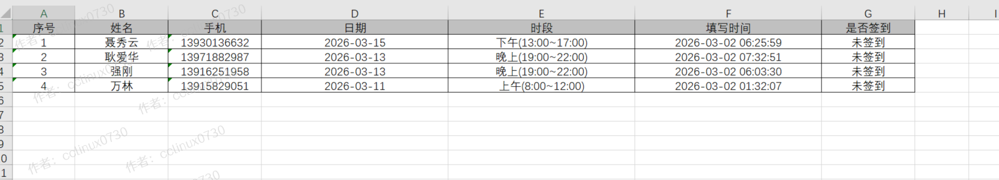
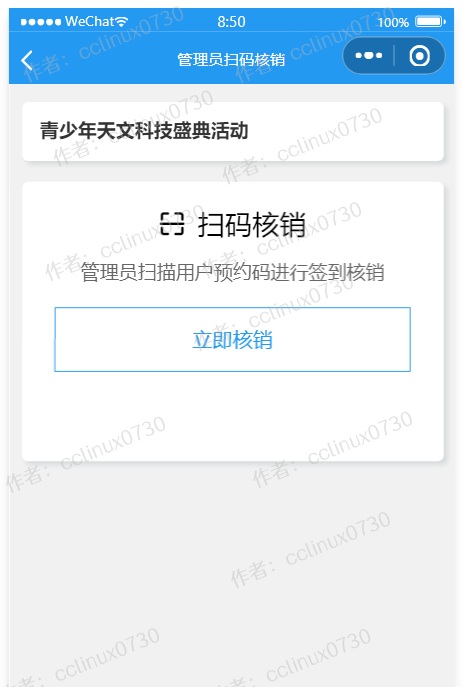 
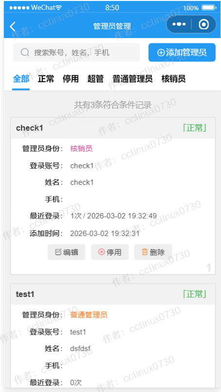 
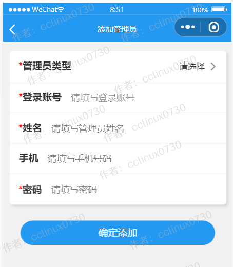  

 